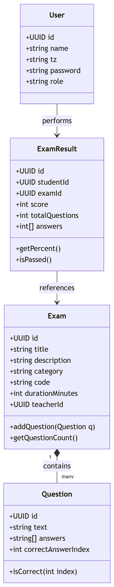

# Exam System

By Ron Kfir (318677028)
Tel-Hai College

## About

A basic website to make and take exams. Built with JavaScript.

## Features

Teachers can log in, create exams, and add questions.
Students can log in, take exams, and see their grades.

## Extras

Timer that ends the exam automatically.
Shows the right answers when you finish.
Dark mode.
Export and import exams using JSON files.
Teachers can see a list of all student scores for their exams.

## Tech

HTML, CSS, and JS.
Uses classes for users, exams, questions, and grades.
Saves data in the local storage.

